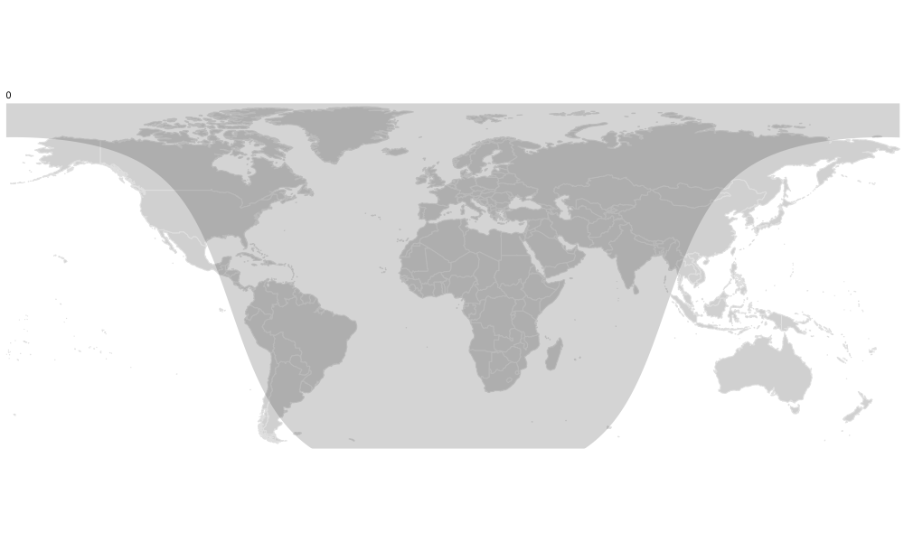

# terminator

Compute Global Terminator (Day/Night) Bands

## Description

Compute global terminator (day/night) bands which can be overlayed as
day and night regions on a ggplot2 world map.

This is an Rcpp port of a [pure R
port](https://github.com/JoGall/terminator) (by @JoGall) of a JS leaflet
plugin.

## What’s Inside The Tin

The following functions are implemented:

  - `terminator`: Compute a single termiantor band
  - `terminator_lat_lon`: Generate a full set of terminator frames

## Installation

``` r
devtools::install_github("hrbrmstr/terminator")
```

## Usage

(NOTE: If you’re trying to just knit this Rmd, remove the `eval=FALSE`
bits. I didn’t want to keep generating things and was too impatient to
wait for a `cache=TRUE` run).

``` r
library(terminator)
library(ggplot2)
library(gganimate) # devtools::install_github("dgrtwo/gganimate")

# current verison
packageVersion("terminator")
```

    ## [1] '0.1.0'

Joe had an asesome idea and made a perfectly fine pure R port. This one
is just a wee bit faster.

``` r
microbenchmark::microbenchmark(
  pure_r = pure_r_terminator(as.POSIXct(Sys.Date()) + (60*60*0), -180, 190, 0.5),
  rcpp = terminator::terminator(as.POSIXct(Sys.Date()) + (60*60*0), -180, 190, 0.5),
  times=100
) -> mb

mb
## Unit: microseconds
##    expr        min        lq        mean      median          uq        max neval
##  pure_r 178131.642 196554.32 206498.7256 204881.1060 214984.7260 339901.567   100
##    rcpp    493.219    642.67    752.3545    747.8535    828.3085   1044.269   100
```

Using Joe’s animation example:

``` r
term_seq <- terminator_lat_lon()

chart <- ggplot(term_seq, aes(frame = frame)) +
  borders("world", colour = "gray90", fill = "gray85") +
  geom_ribbon(aes(lat, ymax = lon), ymin = 90, alpha = 0.2) +
  coord_equal(xlim = c(-180, 190), ylim = c(-58, 85), expand = 0) +
  ggthemes::theme_map()

gganimate(
  chart, 
  interval = 0.1, ani.width=1000, ani.height=600, 
  filename = "terminator-animation.gif"
)
```


